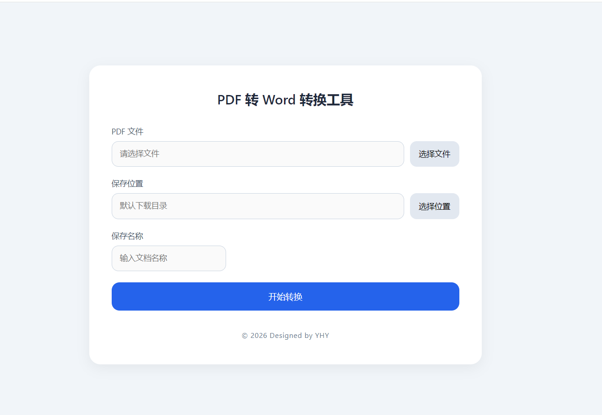
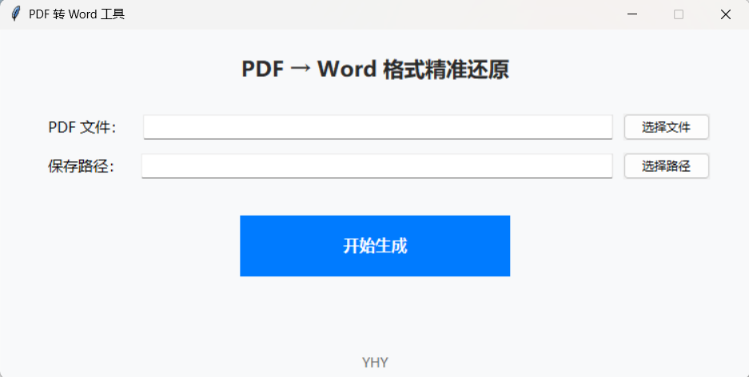

# PDF--word
一个可以用来将PDF转为word的系统，分为两套，一个是纯python+qt实现的，一个是前后端实现的，但在表格还原方面还有缺陷，后期会去在研究研究，也期待各位大佬提出优化方案（Two versions of a PDF-to-Word converter: one purely with Python+Qt, the other frontend-backend. Table reconstruction remains flawed—further improvements planned. Suggestions from experts are welcome.）

